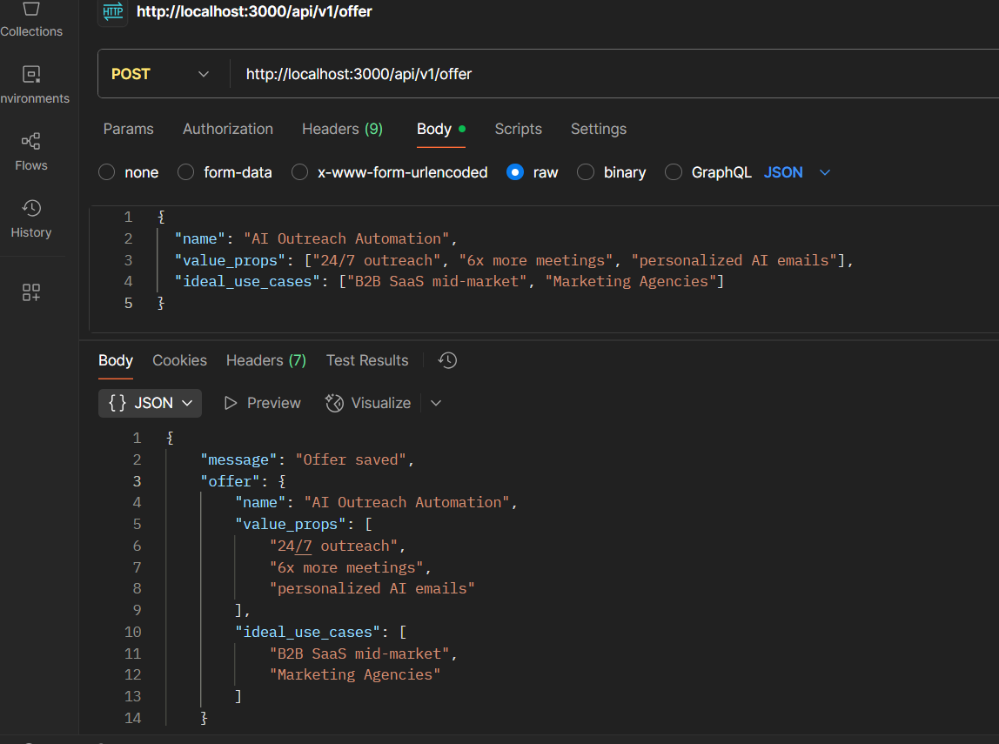
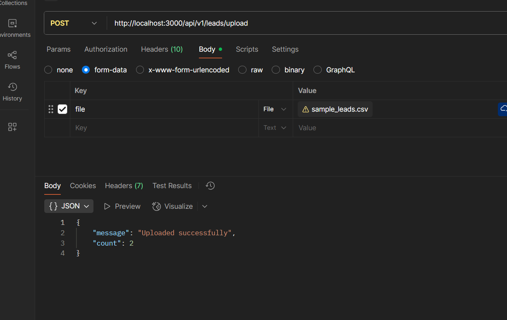
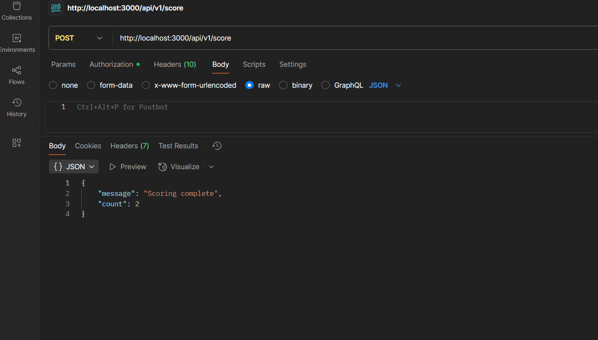
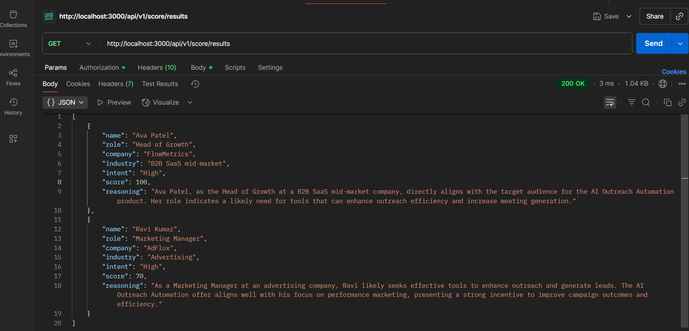
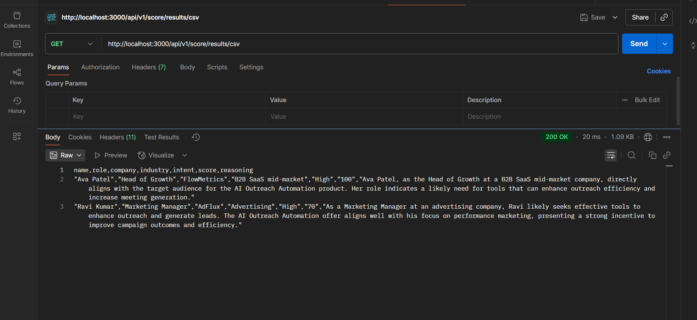

# Backend Engineer Hiring Assignment - Completed Repo

This repository implements the backend assignment:

Api url = http://localhost:3000/api/v1/

- Accepts an offer (POST /offer)
- Accepts leads CSV upload (POST /leads/upload)
- Runs a scoring pipeline (POST /score) combining rule-based logic + AI (OpenAI)
- Returns results (GET /results) and CSV export (GET /results/csv)
- Includes unit tests for the rule layer, Dockerfile, and deployment-ready setup.

## Quick start (local)

1. Install

```bash
npm install
```

2. Create `.env` with:

```
OPENAI_API_KEY=
PORT=3000
```

3. Run dev server

```bash
npm run dev
```

## APIs

### GET/health

Response will be : 


{

    "message":"Kuvaka Backend Assignment API"

}

### POST /offer

Save product/offer JSON body:



### POST /leads/upload

Form-data with key `file` pointing to CSV file (columns: name,role,company,industry,location,linkedin_bio)



### POST /score

Runs scoring pipeline over uploaded leads and saved offer.



### GET /results

Returns JSON array of scored leads.



### GET /results/csv

Returns CSV download of results.

* downloading function will work on browser with route http://localhost:3000/api/v1/score/results/csv



## Rule logic

- Role relevance: decision maker (+20), influencer (+10), else 0
- Industry match: exact ICP (+20), adjacent (+10), else 0
- Data completeness: all fields present (+10)

AI layer:

- Sends structured prompt to OpenAI and maps High=50, Medium=30, Low=10.

## Tests

```bash
npm run test
```

## Docker

Build:

```bash
docker build -t backend-assignment .
docker run -e OPENAI_API_KEY=... -p 3000:3000 backend-assignment
```
